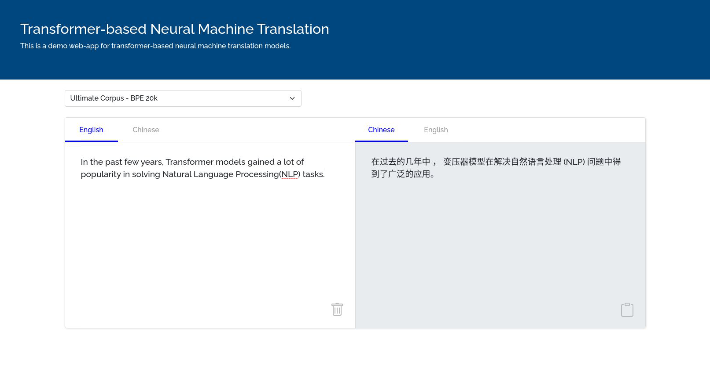

# NMT Web Application

NMT web application is a simple template (built with HTML + JavaScript + Bootstrap 5 + Python) that allows quick set-up for presenting machine translation models to the audiences.



The web application handles a bi-directional translation between two languages and allows switching between different translation models through a drop-down list located at the top left corner. Users can clear the input content and copy the translated content with a single click using the button at the bottom right corner of their corresponding textarea. 

The application requires two parts front-end and back-end. The front-end is the template itself, where the input text is passed to the back-end. The back-end is the translation server/model that translate the input text to a selected target language.

## Installation

The front-end of the web application is almost self-contained and ready for off-line running. All of the required files of the libraries are stored locally in minimised form. The only internet connection requirement is from Google font, but it will not affect the front-end from running.

The back-end requires `Flask` which is a lightweight web framework written in python. 

- Flask: a lightweight web framework, version 2.0.1 is used in the project.  
`pip install flask==2.0.1`


## Run the web app

Run the web application with following command:
```
python app.py
```
NOTICE: the server uses port 3000 by default. However, if the port is in use, the application will ask you to specifiy another port number in the range (0 - 65535).

Open any browser, type in the link (with the default or specified port number) and hit "Enter"
`localhost:3000`
OR
`127.0.0.1:3000`

## Front-end

The front-end is built with HTML + JavaScript(jQuery v3.6.0) + Bootstrap 5 and all libraries' files have been downloaded and stored in the `/demo/static/` folder. Users can type in content at the textarea in white. The content will be passed to the back-end server as a stringified JSON object in the following format once the 'Tab' key is pressed:

```json
{
  "srcLang": string,
  "inputStr": string
}
``` 

The server sends a JSON object back to the front-end once the translation completes, the returned JSON object is in the following format:

```json
{
  "output": string
}
```

Subsequently, the front-end renders the translation at the read-only testarea in grey.

## Back-end

Python is the programming language for the back-end. And it is built using Flask (v2.0.1), which is a lightweight web framework written in Python. 

`/app.py` is the server's entry point and acts as the bridge between the web framework (i.e. Flask) and the translation model.

The `submit()` function handles the information passed in from the front-end using the POST method. The data of the query is parsed straight into the translation model.

The input and output format can be divergent from different models, please consider modifying the code in `index.js -> translate()` and/or `app.py -> submit()` function for a model-specific translation process. 


## Appendix

### Python package List
```
Package           Version  
----------------- ---------
antlr4-python3-runtime 4.8             
cffi                   1.14.6          
click                  8.0.1           
Cython                 0.29.24         
fairseq                1.0.0a0+f2146bd
fastBPE                0.1.0           
Flask                  2.0.1           
hydra-core             1.0.6           
importlib-resources    5.2.0           
itsdangerous           2.0.1           
jieba                  0.42.1          
Jinja2                 3.0.1           
joblib                 1.0.1           
MarkupSafe             2.0.1           
numpy                  1.21.0          
omegaconf              2.0.6           
pip                    20.0.2          
pkg-resources          0.0.0           
portalocker            2.0.0           
pycparser              2.20            
PyYAML                 5.4.1           
regex                  2021.7.6        
sacrebleu              1.5.1           
sacremoses             0.0.45          
setuptools             44.0.0          
six                    1.16.0          
subword-nmt            0.3.7           
torch                  1.9.0           
tqdm                   4.61.2          
typing-extensions      3.10.0.0        
Werkzeug               2.0.1           
zipp                   3.5.0
```