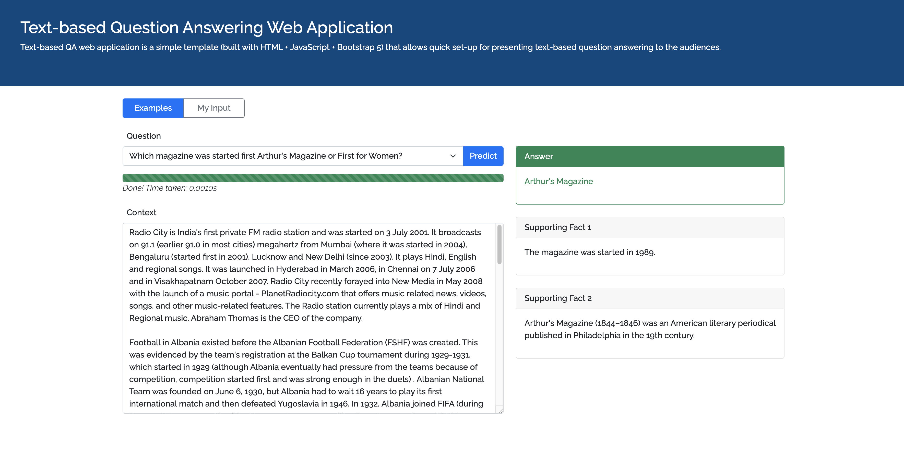

# Text-based QA Web Application

Text-based QA web application is a simple template (built with HTML + JavaScript + Bootstrap 5 + Python) that allows quick set-up for presenting text-based question answering to the audiences.



The web application handles three types of predictions, 'Pre-computed', 'Examples' and 'My Input'. 'Pre-computed' mode is used to present locally stored examples to the audiences when the prediction server/model is inaccessible or for simple showcases. 'Examples' mode uses locally stored examples and passes the selected example to the server for real-time prediction. 'My Input' mode requires a prediction server/model to perform real-time reasoning based on supplied context and question.

The application requires two parts front-end and back-end. The front-end is the template itself, where the examples are stored and customised input are passed to the back-end. The back-end is the prediction server/model that performs the reasoning on the context over the given question and returns the result to the front-end web page. 

## Installation

The front-end of the web application is almost self-contained and ready for off-line running. All of the required files of the libraries are stored locally in minimised form. The only internet connection requirement is from Google font, but it will not affect the front-end from running.

The back-end requires `Flask` and `nltk`, where `Flask` is a lightweight web framework written in python and `nltk` is a toolkit for natural language processing tasks. 

- Flask: a lightweight web framework, version 2.0.1 is used in the project.  
`pip install flask==2.0.1`
- nltk: stands for Natural Language Toolkit. We use it to parse a whole chunk of string into arrays of sentences. This package is OPTIONAL if data pre-processing is not required by the prediction model. Version 3.6.2 is used in the project.   
`pip install nltk==3.6.2`  
NOTICE: nltk requires additional data for the sentence parsing task, please run the Python interpreter and type the following commands OR act according to the instruction of the error message:  
`>>> import nltk`  
`>>> nltk.download('punkt')` 

## Run the web app

Run the web application with following command:
```
python app.py
```
NOTICE 1: nltk requires additional data for the sentence parsing task, please run the Python interpreter and type the following commands OR act according to the instruction of the error message:  
```
>>> import nltk
>>> nltk.download('punkt')
```
Alternatively, run this command in the Terminal:
```
python -m nltk.downloader punkt
```
NOTICE 2: the server uses port 3000 by default. However, if the port is in use, the application will ask you to specifiy another port number in the range (0 - 65535).

Open any browser, type in the link (with the default or specified port number) and hit "Enter"
`localhost:3000`
OR
`127.0.0.1:3000`

## Front-end

The front-end is built with HTML + JavaScript(jQuery v3.6.0) + Bootstrap 5 and all libraries' files have been downloaded and stored in the `/demo/static/` folder. The examples are stored in an array at the beginning of `/demo/static/index.js` in the following format:

```json
[
  {
    question: string,
    context: string,
    answer: string,
    supports: [string]
  },
  .
  .
  .
]
```

Clicking the 'My Input' button allows the user to put their own context and question. The context and question will be passed to the back-end server as a stringified JSON object in the following format once the 'Predict' button is clicked:

```json
{
  "id": string,
  "question": string,
  "context": string
}
``` 

The server sends a JSON object back to the front-end once the prediction process completes, the returned JSON object is in the following format:

```json
{
  "answer": string,
  "supports": [string]
}
```

Subsequently, the front-end renders the answer and the supporting facts (if any) at the right side of the web page.

## Back-end

Python is the programming language for the back-end. And it is built using Flask (v2.0.1), which is a lightweight web framework written in Python. For demonstration purpose, DFGN (Xiao et al., 2019), a multi-hop reasoning model, is used as the prediction model on the server. For more information regarding DFGN, please checkout [their GIT repository](https://github.com/woshiyyya/DFGN-pytorch).

`/app.py` is the server's entry point and acts as the bridge between the web framework (i.e. Flask) and the prediction model (i.e. DFGN model).

The `submit()` function handles the information passed in from the front-end using the POST method. The data of the query is parsed into the following format according to the requirement of the DFGN model:

```json
[
  {
    "_id": string,
    "question": string,
    "context": [[string]]  
  },
  .
  .
  .
]
```

Then, the server parses the original input of `context` into an array of paragraphs where each paragraph consisting an array of sentences like below:

```json
[
  {
    "_id": "Question Id",
    "question": "Question of the query",
    "context": [
      ["Paragraph 1 - Sentence 1 ", "Paragraph 1 - Sentence 2", ..., "Paragraph 1 - Sentence N"],
      ["Paragraph 2 - Sentence 1 ", "Paragraph 2 - Sentence 2", ..., "Paragraph 2 - Sentence N"],
      .
      .
      .
      ["Paragraph M - Sentence 1 ", "Paragraph M - Sentence 2", ..., "Paragraph M - Sentence N"]
    ]  
  },
  .
  .
  .
]
```

If the prediction model needs a different data structure, please consider modifying the `construct_model_data()` function.

After that, the prediction model takes the parsed data and computes the result. The expected format of the result is following:

```json
{
  "answer": {
      _id: answer(string)
  }, 
  "sp": {
    _id: [
      [paragraph_id(string), sentence_index(int)],
      .
      .
      .
    ]
  }
}
``` 

The `_id` field is the original input of the question id, followed by either the answer of the question in string format under `"answer"` or an array of supporting facts in paragraph id and sentence index pair. The `extract_answer_from_model_output()` function will extract the supporting sentences from corresponding paragraphs and form an object to pass back to the front-end in the following format, which also mentioned in the front-end section:

```json
{
  "answer": string,
  "supports": [string]
}
```

The output format of the prediction model can be divergent from different models, please consider modifying the `extract_answer_from_model_output()` function for the model-specific extraction process. 


## Appendix

### Python package List
```
Package           Version  
----------------- ---------
asgiref           3.4.0    
bidict            0.21.2   
blis              0.4.1    
boto3             1.17.101 
botocore          1.20.101 
catalogue         1.0.0    
certifi           2021.5.30
chardet           4.0.0    
click             7.1.2    
cymem             2.0.5    
Django            3.2.4    
en-core-web-lg    2.2.5    
filelock          3.0.12   
Flask             2.0.1    
Flask-SocketIO    5.1.0    
idna              2.10     
image             1.5.33   
itsdangerous      2.0.1    
Jinja2            3.0.1    
jmespath          0.10.0   
joblib            1.0.1    
MarkupSafe        2.0.1    
murmurhash        1.0.5    
nltk              3.6.2    
numpy             1.21.0   
packaging         20.9     
pandas            1.2.5    
pathy             0.6.0    
Pillow            8.2.0    
pip               20.0.2   
pkg-resources     0.0.0    
plac              1.1.3    
preshed           3.0.5    
protobuf          3.17.3   
pydantic          1.7.4    
pyparsing         2.4.7    
python-dateutil   2.8.1    
python-engineio   4.2.0    
python-socketio   5.3.0    
pytz              2021.1   
regex             2021.4.4 
requests          2.25.1   
s3transfer        0.4.2    
sacremoses        0.0.45   
scikit-learn      0.24.2   
scipy             1.7.0    
sentencepiece     0.1.96   
setuptools        44.0.0   
six               1.16.0   
sklearn           0.0      
smart-open        5.1.0    
spacy             2.2.4    
spacy-legacy      3.0.6    
sqlparse          0.4.1    
srsly             1.0.5    
tensorboardX      2.3      
thinc             7.4.0    
threadpoolctl     2.1.0    
tokenizers        0.10.3   
torch             1.4.0    
tqdm              4.61.1   
typer             0.3.2    
typing-extensions 3.10.0.0 
ujson             4.0.2    
urllib3           1.26.6   
wasabi            0.8.2    
Werkzeug          2.0.1  
```